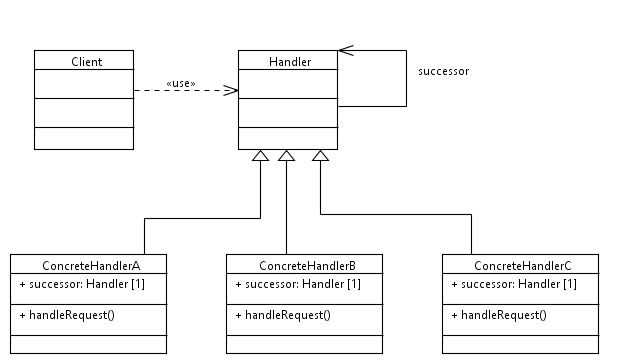

----------------------------------------------------------------------------------------------------------------
#The Chain of Responsibility Pattern

###Sources:
Notes below regarding Chain of Responsibility pattern taken from "Design Patterns - Elements of Reusable Object-Oriented Software"
By Gamma, Helm, Johnson, Vlissides

Example Code provided by Derek Banas:
Tutorial: https://www.youtube.com/watch?v=jDX6x8qmjbA
Source Code: http://www.newthinktank.com/2012/10/chain-of-responsibility-design-pattern-tutorial/

###Author: Justin J

###Purpose: FAU Object Oriented Software Design Course, Sprint 2017

----------------------------------------------------------------------------------------------------------------

##Intent
- avoid coupling sender to receiver by giving more than one object a chance to handle the request
- chain receiving objects and pass request along until an object can handle

##Motivation
- way to decouple button that initiates request from the objects that might respond to request
- give multiple objects a chance to handle the request
- request has an implicit receiver
- each object on chain must share common interface for handling requests and accessing successor to forward

##Applicability
- use when more than object may handle a request, and handler isn't known a priori
- when you want to issue a request to one of several objects without specifying the receiver explicitly
- when set of objects that can handle a request should be specified dynamically

##Structure
 

##Participants
####Handler
- defines interface for handling requests and optionally implements successor link
####ConcreteHandler
- handles requests it is responsible for, else passes request to successor
- can access successor
####Client
- initiates request to a COncreteHandler object on the chain

##Collaborations
- when client issues request, it propagates along chain until ConreteHandler object takes responsibility

##Consequences
- reduced coupling - frees object from knowing which other object handles a request
	- receiver and sender have no explicit knowledge of each other
- added flexibility in assigning responsibilities to objects	
	- added flexibility in distributing responsibilities among objects
- receipt is not gauranteed
	- no gaurantee request will be handled, because not explicitly defines

##Implementation
- implementing successor chair - two methods:
	- define new links
	- use existing links
- connecting successors
	- handler defines interface for requests and usually maintains the successor as well
- representing requests
	- simplest form request is hard coded operation invocation
		- convenient and safe but restricts you to fixed set of requests that are defined
	- single handler function that takes request code (constant) as parameter
		- requires conditional statements for dispatching the request based on its code
- automatic forwarding in smalltalk
	- use doeNotUnderstand mechanism in Smalltalk to forward requests
	
##Related Patterns
- composite pattern